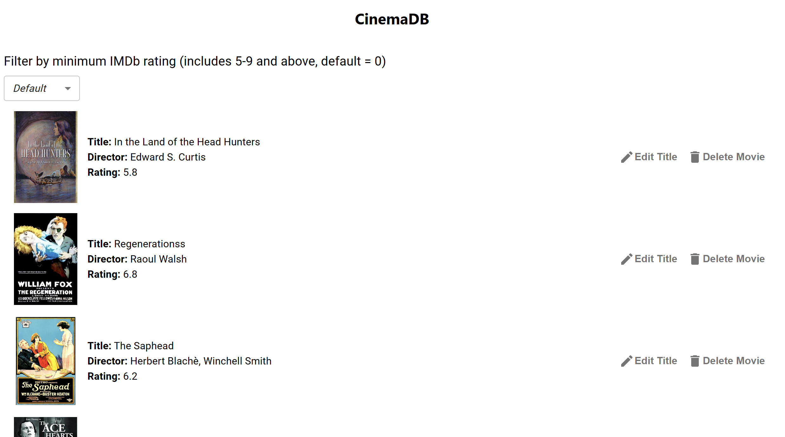

# CinemaDB - Movie Database Application

## Project Overview

CinemaDB is a web application designed to provide users with the ability to explore, update, and manage a database of movies. This project utilizes a React frontend and an Express backend with MongoDB for data storage, making it a full-stack application.

## Features

- **Browse Movies**: Users can view all movies in the database with options to filter movies based on their IMDb rating.
- **Edit Movies**: Authorized users can update information of the movies (only title for now).
- **Delete Movies**: Users can remove movies from the database.

## API Endpoints

The application offers several RESTful endpoints:

- `GET /movies`: Fetches a list of movies, with optional filtering based on IMDb rating.
- `GET /movies/:id`: Retrieves detailed information about a specific movie.
- `PATCH /movies/:id`: Updates information for a specific movie.
- `DELETE /movies/:id`: Deletes a specific movie from the database.

## How to Run Locally

### Prerequisites

- Node.js
- MongoDB
- Git

### Setup Instructions

1. **Clone the Repository**

    ```bash
    git clone https://github.com/tly20012/cinemadb.git
    cd cinemadb
    ```

2. **Install Dependencies**

    Navigate to the project directory and install the necessary packages:

    ```bash
    npm install
    ```

3. **Environment Variables**

    Create a `.env` file in the root of your project and update it with your MongoDB URI, database name, and any other configurations:

    ```
    MONGODB_URI=<your-mongodb-uri>
    PORT=8080
    ```

4. **Start the Backend Server**

    ```bash
    node index.js
    ```

5. **Run the Frontend**

    Navigate to the `react-app` folder and start the React development server:

    ```bash
    cd react-app
    npm start
    ```

    This should launch the application on `http://localhost:3000`.

## Screenshots



## Contributing

Contributions are what make the open source community such an amazing place to learn, inspire, and create. Any contributions you make are **greatly appreciated**.

